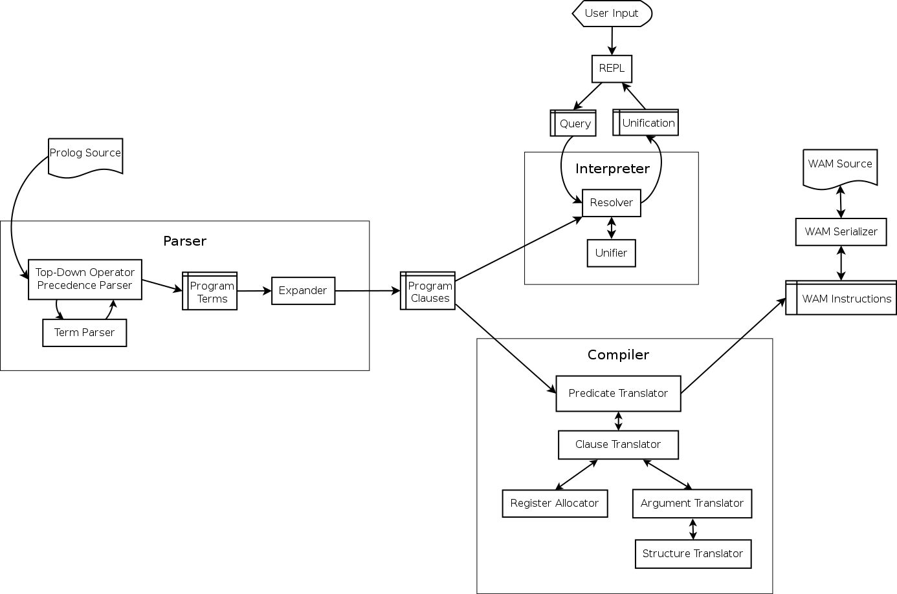

.. role:: pl(code)
   :language: prolog

.. default-role:: pl

Hasklog |ci-badge|_ |ghc-badge|_ |stack-badge|_ |license-badge|_
=======

.. |ci-badge| image:: https://travis-ci.org/cimbul/hasklog.svg
.. _ci-badge: https://travis-ci.org/cimbul/hasklog
.. |ghc-badge| image:: https://img.shields.io/badge/dynamic/yaml.svg?label=ghc&query=ghc&url=https%3A%2F%2Fraw.githubusercontent.com%2Fcimbul%2Fhasklog%2Fmain%2F.travis.yml
.. _ghc-badge: .travis.yml
.. |stack-badge| image:: https://img.shields.io/badge/dynamic/yaml.svg?label=stack&query=resolver&url=https%3A%2F%2Fraw.githubusercontent.com%2Fcimbul%2Fhasklog%2Fmain%2Fstack.yaml
.. _stack-badge: stack.yaml
.. |license-badge| image:: https://img.shields.io/github/license/cimbul/hasklog.svg
.. _license-badge: LICENSE

Hasklog is a interpreter and compiler for a subset of Prolog. Hasklog is
written in Haskell. Its features include:

-  Full and correct support for resolution of logical goals, including
   recursive rules and nested structures

-  Negation as a failure

-  A compiler targeting a simplified version of the *Warren Abstract
   Machine* (WAM), as defined in `Hasan Ait-Kaci’s reconstruction
   <http://wambook.sourceforge.net/wambook.pdf>`_

-  Lists and numbers (but unfortunately no math at this point)

-  User-defined operators

.. contents::
   :depth: 2
   :backlinks: none

Using Hasklog
=============

Setup
-----

Hasklog can be built with `Cabal <https://www.haskell.org/cabal/>`_ or
`Stack <https://docs.haskellstack.org/en/stable/README/>`_. The instructions
below assume you are using Stack.

Run the following commands inside the directory where you unpacked Hasklog:

.. code:: console

   $ stack build

Now you can run Hasklog from the Stack build directory:

.. code:: console

   $ stack run

Or install the ``hasklog`` executable on your system:

.. code:: console

   $ stack install
   $ hasklog  # Assuming you have ~/.local/bin in your PATH

Tests
-----

To run the Hasklog unit tests:

.. code:: console

   $ stack test

Usage
-----

When you first start Hasklog, the program presents an interactive prompt
where you can run queries and built-in commands:

.. code:: console

   $ hasklog
   ?-

You can read in files using the *consult/1* command. Alternatively, you
can specify files to consult through the command line:

.. code:: console

   $ hasklog file1 file2
   ?-

When you are finished with your session, press *Control+D* to quit.

Examples
--------

The following sections contain example sessions using the files provided
in the ``examples/`` directory.

Family Tree Database
~~~~~~~~~~~~~~~~~~~~

.. code:: prolog

   ?- consult('examples/family_trees').
   true.
   ?- parent_child(bill, ted).
   true.
   ?- parent_child(ted, bill).
   false.
   ?- parent_child(Who, bob).
   Who = bill ? ;

   Who = mary ? ;

   false.
   ?- ancestor_descendent(kim, Whom).
   Whom = george ? ;

   Whom = mary ? ;

   Whom = ted ? ;

   Whom = bob ? ;

   false.
   ?- ancestor_descendent(Who, ted).
   Who = bill ? ;

   Who = mary ? ;

   Who = george ? ;

   Who = susan ? ;

   Who = dave ? ;

   Who = kim ? ;

   false.
   ?- ^D

List Processing
~~~~~~~~~~~~~~~

.. code:: prolog

   ?- consult('examples/lists').
   true.
   ?- member(What, [a,b,c]).
   What = a ? ;

   What = b ? ;

   What = c ? ;

   false.
   ?- append([a,b,c], [d,e,f], What).
   What = [a,b,c,d,e,f] ? ;

   false.
   ?- append(What, [d,e,f], [a,b,c,d,e,f]).
   What = [a,b,c] ? ;

   false.
   ?- reverse([a,b,c,d]).
   What = [d,c,b,a] ? ;

   false.
   ?- ^D

Compiling
~~~~~~~~~

.. code:: prolog

   ?- consult('examples/lists').
   true.
   ?- consult('examples/family_trees').
   true.
   ?- consult('examples/crazy_structures').
   true.
   ?- compile('examples/everything').
   true.
   ?- ^D

At the end of this session, there should be a file named
``everything.wam`` in the ``examples/`` directory. It will contain WAM
instructions in text format for all the predicates defined in all three
examples files.

Technical Description
=====================

Architecture
------------

Hasklog is roughly divided into a parser, interpreter, and compiler
units as shown in the `figure below <#fig:architecture>`__. The job of each of
these units is described in the following sections.

   **Architecture diagram**. This version is slightly simplified. The
   interpreter is actually involved in parsing program clauses, so that
   directives in the source file (such as *op/3* definitions and
   *consult/1* directives) can be executed as they are read. Also, the
   compiler is run by the interpreter as a built-in predicate. The
   internal architectures are still accurate.

Parser
------

The parser is defined in ``src/Hasklog/Parser.hs``. Its job is to
transform the concrete representation of Prolog rules into a list of
rule data structures. We can divide this task into two levels: parsing
rules, and parsing terms.

Rules
~~~~~

Consider the following input:

.. code:: prolog

   foo(X) :- bar(X, Y).
   foo(a).
   bar(Z, Z).

This will be transformed into a list of data structures of the form:

.. math:: \mathbf{DefiniteClause} \; h \; [g_1, g_2, \ldots, g_n],

where :math:`h` is the representation of the head of the clause, and
:math:`g_n` is the representation of goal :math:`n` in the body. Facts
(heads with no body) are represented in the same form, but the list of
goals is empty.

Queries and directives (rules with no heads) are represented in the
form:

.. math:: \mathbf{GoalClause} \; [g_1, g_2, \ldots, g_n].

Terms
~~~~~

The next problem is how to represent the terms in the head and body of
rules themselves. A *term* is one of:

-  An *atom*: `a`, `foo`, `'with Quotes!'`, `–>`

-  A *variable*: `X`, `SomeVar`

-  A *number*: `123`

-  A *compound term*: `f(a,b)`, `p(X, h(f(a), b))`

These are represented in the following forms:

-  :math:`\mathbf{Atom}\; a`

-  :math:`\mathbf{Variable}\; v`

-  :math:`\mathbf{Number}\; n`

-  :math:`\mathbf{CompoundTerm}\; f \; [t_1, t_2, \ldots, t_n]`

where:

-  :math:`a`, :math:`v`, and :math:`f` are the string representations of
   the atom, variable, and functor, respectively,

-  :math:`n` is the integer represented by the number token, and

-  :math:`t_n` is the :math:`n`\ th subterm of the compound term.

Because compound terms contain other terms, the overall structure of
parsed terms is a tree.

A final issue is how to deal with operators. Hasklog supports
user-defined operators, which are simply functors of arity 1 or 2 that
are written in prefix, postfix, or infix notation. For example, the
expression `a :- b` is really a compound term with functor *:-/2*, and
can also be written as `:-(a, b)`. Hasklog uses a *top-down operator
precedence parser* to parse operations, which are then transformed into
their term representation.

Interpreter
-----------

The interpreter is defined in ``src/Hasklog/Interpreter.hs``. Its job is
to find logical solutions to queries using rules defined in a program.
For example, consider the program:

.. code:: console

   parent_child(bill, ted).
   parent_child(bill, bob).
   parent_child(mary, ted).
   parent_child(mary, bob).
   parent_child(george, mary).
   parent_child(susan, mary).

   female(mary).
   female(susan).
   male(bill).
   male(ted).
   male(bob).
   male(george).

   mother_child(Mother, Child) :- female(Mother), parent_child(Mother, Child).
   father_child(Father, Child) :- male(Father), parent_child(Father, Child).

Some queries that could be performed on this program include:

-  `?- mother_child(susan, ted).` – Is `susan` the mother of
   `ted`?

-  `?- father_child(Who, mary).` – `Who` is the father of `mary`?

To properly match these queries to rules in the program, we need two
pieces: unification and resolution.

Unification
~~~~~~~~~~~

Unification is the process of substituting variables in two terms so
that they match. For instance, `f(X, b)` can be unified with
`f(g(a), Y)` by setting :math:`X = g(a)` and :math:`Y = b`, so that
both terms are equal to `f(g(a), b)`.

Unification is essentially the process of walking two term trees
simultaneously and matching variables in one tree to the corresponding
term in the other tree. We also have to obey a few rules:

-  A variable can only have one substitution. We cannot unify
   `f(X, X)` ~ `f(a, b)`, because that would require setting
   :math:`X = a` and :math:`X = b` at the same time.

-  Only variables can be substituted. We cannot unify `f(a)` ~ `f(b)`
   by substituting :math:`a = b`.

-  A variable cannot unify with a compound term that it occurs in
   (*occurs check*). We cannot unify `X` ~ `f(a, X)`, because that
   would produce a cyclic term.

In many cases, unification is impossible, so we have to handle failure
appropriately.

Resolution
~~~~~~~~~~

The heart of Prolog is *resolution*. Resolution is an logical inference
rule that can be used to solve the satisfiability problem for Horn
formulas.

Consider a query:

.. code:: prolog

   ?- g1, g2, ..., gn.

where :math:`g_n` are independent goals in the query. We can determine
whether all the goals are true by trying to prove any of them wrong. If
none of them can be proved wrong, then they are all true. Turning this
into logical form:

.. math::

   \begin{aligned}
   & \neg(g_1 \wedge g_2 \wedge \ldots \wedge g_n) \\
   =\; &\neg g_1 \vee \neg g_2 \vee \ldots \vee \neg g_n\end{aligned}

Now assume we have a rule:

.. code:: prolog

   g1 :- h1, h2, ..., hn

We can represent this in logical form as:

.. math::

   \begin{aligned}
   & g_1 \leftarrow h_1 \wedge h_2 \wedge \ldots \wedge h_m \\
   =\; & g_1 \vee \neg (h_1 \wedge h_2 \wedge \ldots \wedge h_m) \\
   =\; & g_1 \vee \neg h_1 \vee \neg h_2 \vee \ldots \vee \neg h_m\end{aligned}

If we assume that both our goal and this rule are true, then we have:

.. math::

   \begin{aligned}
   & (g_1 \vee \neg h_1 \vee \neg h_2 \vee \ldots \vee \neg h_m) \wedge (\neg g_1 \vee \neg g_2 \vee \ldots \vee \neg g_n) \\
   =\; & (g_1 \vee \neg (h_1 \wedge h_2 \wedge \ldots \wedge h_m)) \wedge (\neg g_1 \vee \neg (g_2 \wedge \ldots \wedge g_n))
   \end{aligned}

Now notice that if :math:`g_1` is true, then :math:`\neg g_1` would be
false and :math:`\neg (g_2 \wedge \ldots \wedge g_n)` would have to be
true. If :math:`g_1` were false, then
:math:`\neg (h_1 \wedge \ldots \wedge h_n)` would have to be true. In
other words, one of the non-\ :math:`g_1` terms must be true no matter
what :math:`g_1` is, so we can eliminate :math:`g_1` altogether and get:

.. math::

   \begin{aligned}
   & \neg (h_1 \wedge h_2 \wedge \ldots \wedge h_m) \wedge \neg (g_2 \wedge \ldots \wedge g_n) \\
   =\; & \neg h_1 \vee \neg h_2 \vee \ldots \vee \neg h_m \vee \neg g_2 \vee \ldots \vee \neg g_n
   \end{aligned}

This last step is “resolution" proper. We now have a *new* set of goals,
and we can repeat the procedure on this new set. We repeat until we
either eliminate all the variables, proving our negation false and the
original goals true, or until we have no rules left to resolve with,
proving our negation true and the original goals false.

In summary, the steps of resolution are:

#. Negate the original goal clause.

#. Find a rule to unify with. If no rules unify, then fail.

#. Resolve against that rule to generate a new goal clause.

#. If nothing is left, succeed. Otherwise, repeat from step 2.

This is the basic algorithm used by Hasklog, except that it also has to
deal with the question of which rule to unify with when there are
several possible alternatives. It handles this by (lazily) taking all
possible paths and concatenating all the results into a single list. The
result takes the same space complexity as so-called “backtracking"
algorithms, but in a much more straightforward manner.

Compiler
--------

The compiler is defined in ``src/Hasklog/Compiler.hs``. Its job is to
take the rules in a program and translate them to a series of
instructions for the Warren Abstract Machine (WAM). The details of the
WAM are much too complicated to lay out here, but they can be found in
*Warren’s Abstract Machine: A Tutorial Reconstruction* by Hasan
Ait-Kaci (`here <http://wambook.sourceforge.net/wambook.pdf>`_). The version of the WAM targeted by Hasklog is the one
laid out in chapters 1-3 of that book. It does not include the many
optimizations in chapter 4.

A simplified view of the job of the compiler is to take the rules and
define them as callable procedures. These procedures are passed
arguments through predefined registers. A rule of the form:

.. code:: prolog

   p(a1, a2, ..., an) :- q1(b1, b2, ..., bm), q2(...), ..., qn(...).

does the following:

#. Allocate space on the stack to store variables

#. Extract the arguments :math:`a_1, \ldots, a_n` of :math:`p/n` and
   pull them onto the stack.

#. Pull the arguments :math:`b_1, \ldots, b_m` of :math:`q_1/m` from the
   stack and put them in registers, and call :math:`q_1/m`

#. Do the same for the rest of the goals.

While arguments, which contain references to terms in memory, are being
moved from the stack to registers, their values are being unified. If
unification fails, the whole rule fails. If more rules are possible,
then the machine will try the other alternatives.

The compiler has to determine the right instructions in the right order
to make this happen. Some examples of instructions are:

::

   allocate 5
   get_variable Y4 A1
   get_value Y4 A2
   put_variable Y3 A2
   put_structure f/2 A3
   unify_value X4
   unify_value Y2
   deallocate

where terms like :math:`X1`, :math:`A2`, and :math:`Y4` denote temporary
registers, argument registers, and stack locations, respectively.

Some of the complications the compiler has to deal with include:

-  Assigning variables (and partially constructed structures) to
   appropriate registers.

-  Deciding whether to keep variables in the stack or in temporary
   registers.

-  Ordering the construction of nested terms so that they are
   constructed before the terms that contain them.

Reference
=========

The following built-in commands are available for you to use in Hasklog:

`consult(+Filename)`
   Read the Prolog source file *“<Filename>.pl"* into the current
   session.

`compile(+Filename)`
   Compile all the predicates defined in the current session into WAM
   code, and dump the compiled output to *“<Filename>.wam"*.

`not Goal`
   Negation as a failure: try to resolve *Goal*. Fail if a resolution
   is found, otherwise succeed.

`true`
   Succeed without triggering any unification.

`fail`
   Fail the current rule immediately.

`op(+Precedence, +Type, +Symbol)`
   Define a new operator *Symbol* with precedence *Precedence* and
   fixity and associativity defined by *Type*. Valid values for *Type*
   are:

   `fx`
      A non-associative prefix operator.

   `fy`
      A right-associative prefix operator.

   `xf`
      A non-associative postfix operator.

   `yf`
      A left-associative prefix operator.

   `xfx`
      A non-associative infix operator.

   `xfy`
      A right-associative infix operator.

   `yfx`
      A left-associative infix operator.
